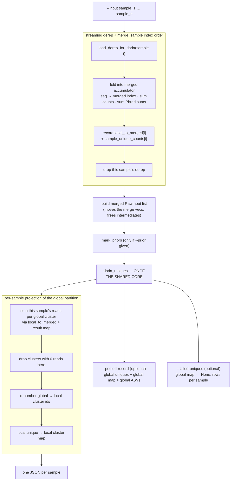

# `dada-pooled` — one partition across all samples

Every sample's uniques are merged into a single table, [the shared
core](algorithm-core.md) runs **once** on it, and the resulting global partition
is then projected back into per-sample outputs. Abundance evidence therefore sums
across samples: a variant seen once in each of forty samples arrives at the
denoiser with abundance forty.

Source: [`main.rs:1214`][cmd]

## What this mode does

The `dada_uniques` node is [The shared denoising core](algorithm-core.md) — the
same seven wrapper steps and the same A–H loop as every other mode, just handed a
much larger table.

## Step by step

### 1. Validate and set up

`--sample-names`, if given, must have exactly one entry per input file. The output
directory is created, and a single rayon pool of `--threads` is built — pooled mode
has one core invocation, so there is no sample-level fan-out to split threads
between.

### 2. Streaming dereplicate and merge

[`main.rs:1314`][merge] — one loop, one sample at a time, in input order.

Each sample is loaded, folded into the merged accumulator, and then dropped before
the next is read. The accumulator holds:

| Structure | Contents |
| --- | --- |
| `seq_to_merged` | sequence → merged unique index (dropped after the loop) |
| `merged_seqs` | the merged unique sequences |
| `merged_qual_sum` | per-position Phred **sums** across samples, as `u32` |
| `merged_total` | pooled abundance per merged unique |
| `local_to_merged[s]` | sample `s`'s local unique index → merged index |
| `sample_unique_counts[s]` | sample `s`'s local read counts |

!!! note "Why streaming, and why order matters"
    Holding every sample's derep through the merge used to be the pooled memory
    peak; loading one at a time removed that (issue 41). Folding must be serial
    anyway, and derep is a small fraction of pooled wall time, so serializing the
    load is cheap. Fold order is sample index order, exactly as the old parallel
    path produced, so the merged table — and every output byte — is unchanged.

The per-position quality **sum** is the merge-able quantity: a sample's derep
already stores sums, so merging is addition. A `checked_add` guards the
astronomically unlikely `u32` overflow rather than wrapping silently.

### 3. Build the merged `RawInput` list

[`main.rs:1393`][ri]

The merge vectors are *moved* into `RawInput`s, not cloned, so each intermediate
is freed as the list is built instead of sitting resident through the core call
(issue 39). Quals are already sums, so no conversion happens. Empty input across
all files is an error here.

### 4. Optionally mark priors

Same `mark_priors` as the other modes, applied to merged uniques. Pooled runs
usually omit `--prior`; when present, flagged uniques are tested against
`OMEGA_P` in the core's step E.

### 5. Denoise once

[`main.rs:1477`][core]

`dada_uniques` runs a single time on the merged table. Two consequences worth
holding onto:

!!! important "`nraw` is the merged count"
    The Bonferroni divisor for the abundance p-value in the core's step E is the
    number of **merged** uniques, not a per-sample count. Pooling therefore
    raises the bar for significance at the same time as it raises abundance —
    the sensitivity gain is the net of those two effects, not the first alone.

!!! warning "Per-sample outputs are not independent results"
    Every per-sample JSON is a projection of one global partition. Adding or
    removing a sample can change the ASVs reported for the others.

### 6. Project back per sample

[`main.rs:1550`][proj]

For each sample: walk its local uniques through `local_to_merged` and
`result.map`, summing that sample's read counts into per-global-cluster totals;
drop clusters with zero reads in this sample; renumber the surviving global
cluster ids to dense local ids; and build the local unique → local cluster map.
The output shape matches single-sample [`dada`](algorithm-dada.md), which is what
lets downstream commands treat both identically.

### 7. Optional pooled-level outputs

**`--pooled-record`** [`main.rs:1632`][rec] writes one self-contained record with
the merged uniques at their **pooled** abundance, the global `map`, and the global
ASVs. It exists because a pool-level analysis must not re-aggregate the per-sample
projections — doing that double-counts sequences shared between samples and
re-derives the failed-singleton split from local counts. This is the input
`kdist-calibrate --from-dada-pooled` expects. Off by default, and written to an
explicit path rather than `--output-dir` so it never lands in the per-sample
`*.json.gz` glob downstream steps rely on; gzip follows the path's own `.gz`
extension, not `--gzip`.

**`--failed-uniques`** treats failure as a global property (`result.map[mu]` is
`None`), emitting one row per sample the failed merged unique appears in, carrying
that sample's read count.

### 8. Verbose phase accounting

[`main.rs:1692`][phase] reports derep, merge, `run_dada` and output wall times
with percentages, labelled serial or parallel. Only `run_dada` is parallel, so the
other three bound achievable speedup — see [Results](results.md). Peak RSS is
reported after merge and after the core call, the two points that define the
pooled memory profile.

[cmd]: https://github.com/HPCBio/dada2-rs/blob/33ed55b1d6078aa16c8ab4b6db0509383b0c4e09/src/main.rs#L1214
[merge]: https://github.com/HPCBio/dada2-rs/blob/33ed55b1d6078aa16c8ab4b6db0509383b0c4e09/src/main.rs#L1314-L1353
[ri]: https://github.com/HPCBio/dada2-rs/blob/33ed55b1d6078aa16c8ab4b6db0509383b0c4e09/src/main.rs#L1393-L1407
[core]: https://github.com/HPCBio/dada2-rs/blob/33ed55b1d6078aa16c8ab4b6db0509383b0c4e09/src/main.rs#L1477-L1479
[proj]: https://github.com/HPCBio/dada2-rs/blob/33ed55b1d6078aa16c8ab4b6db0509383b0c4e09/src/main.rs#L1550-L1617
[rec]: https://github.com/HPCBio/dada2-rs/blob/33ed55b1d6078aa16c8ab4b6db0509383b0c4e09/src/main.rs#L1632-L1675
[phase]: https://github.com/HPCBio/dada2-rs/blob/33ed55b1d6078aa16c8ab4b6db0509383b0c4e09/src/main.rs#L1692-L1702
