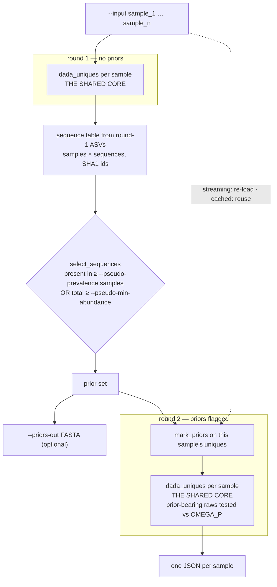

# `dada-pseudo` — two rounds with priors between

Each sample is denoised twice. Round 1 denoises every sample independently, and
sequences that recur across those independent results are promoted to **priors**.
Round 2 re-denoises every sample with those priors flagged, which lets the core
test them against `OMEGA_P` instead of the Bonferroni-corrected `OMEGA_A`.

That is the whole idea: a unique that is a singleton in *this* sample can still be
called, because the pool has already vouched for the sequence elsewhere. It
approximates [`dada-pooled`](algorithm-dada-pooled.md)'s sensitivity at per-sample
memory cost.

Source: [`main.rs:1706`][cmd]

## What this mode does

Both `dada_uniques` nodes are [The shared denoising core](algorithm-core.md) — the
same code, called twice per sample. The only difference between the rounds is
whether `RawInput::prior` is set.

## Step by step

### 1. Choose the memory strategy

[`main.rs:1751`][mem]

Streaming is the default: `low_memory = !cache_samples`. Each sample is loaded,
denoised and dropped, so only the samples currently in flight are resident.
`--cache-samples` instead pre-loads every sample's uniques and holds them for
round 2, trading memory for not re-reading the inputs.

!!! note "Streaming is Pareto-better here, which is why it is the default"
    Round 2 needs each sample's uniques again, so caching looks free — but
    holding all samples resident to avoid one re-read costs far more memory than
    the re-read costs time. Keeping `--cache-samples` off by default was settled
    deliberately; see [Results](results.md).

Both paths fan samples across sub-pools with the same
`for_each_sample_concurrent` used by [`dada`](algorithm-dada.md), so
`--sample-jobs` and `--threads` behave identically.

### 2. Round 1 — denoise each sample alone

[`main.rs:1814`][r1]

No priors are set, so this round is exactly a [`dada`](algorithm-dada.md) run:
independent per-sample partitions, each unique judged only against its own
sample's evidence. What is kept is each sample's ASV list (sequence and
abundance) — plus, under `--cache-samples`, the uniques themselves.

### 3. Build a sequence table from round-1 ASVs

[`main.rs:1897`][tbl]

A samples × sequences count matrix over the union of round-1 ASVs, with SHA1
sequence ids. Note the input is **ASVs, not uniques**: only sequences that
survived round 1 somewhere are eligible to become priors.

### 4. Select the priors

[`select_sequences`, `main.rs:4704`][sel]

A sequence is selected if **either** test passes:

- it is present in at least `--pseudo-prevalence` samples, **or**
- its total abundance across samples is at least `--pseudo-min-abundance`.

!!! important "The two tests are OR, not AND"
    A sequence needs to clear only one. Prevalence catches variants that are
    thinly spread but consistent; abundance catches variants concentrated in few
    samples. Tightening one does not constrain the other.

Optionally dumped as FASTA with `--priors-out`.

### 5. Note when round 2 is a no-op

[`main.rs:1960`][noop]

With fewer than two samples, or when nothing meets the threshold, the prior set is
empty and round 2 reproduces round 1. Under `--verbose` this is stated explicitly
rather than silently costing a second pass — worth watching for, since it is the
signature of a prevalence setting that is too strict for the sample count.

### 6. Round 2 — re-denoise with priors flagged

[`main.rs:1971`][r2]

`mark_priors` flags matching uniques in each sample, then the core runs again. In
the streaming path each sample is re-loaded and marked on the owned copy; in the
cached path the retained uniques are marked in place. Per-sample verbose output
reports how many of each sample's uniques were flagged.

Inside the core, the flag changes exactly one thing — which threshold step E
applies:

| Raw | Test in step E |
| --- | --- |
| ordinary | abundance p-value vs Bonferroni-corrected `OMEGA_A` |
| `prior` set | p-value vs `OMEGA_P` |

Everything else — alignment, lambda, shuffling, `OMEGA_C` attribution — is
unchanged. Round 2's output JSONs are the mode's result; round 1 is scaffolding.

## Relationship to the other modes

Pseudo-pooled is **not** a cheaper pooled run. Pooled sums abundance into one
significance test over one merged table; pseudo keeps per-sample tables and
relaxes the threshold for sequences the pool has already supported. The two can
disagree in both directions:

- Pooled can call a variant that is below the prior rule in every individual
  sample, because summed abundance alone carries it.
- Pseudo can call a variant that pooling misses, because pooling's larger `nraw`
  raises the Bonferroni bar (see
  [`dada-pooled`](algorithm-dada-pooled.md#5-denoise-once)).

See [Denoising modes](algorithm.md) for the side-by-side comparison.

[cmd]: https://github.com/HPCBio/dada2-rs/blob/33ed55b1d6078aa16c8ab4b6db0509383b0c4e09/src/main.rs#L1706
[mem]: https://github.com/HPCBio/dada2-rs/blob/33ed55b1d6078aa16c8ab4b6db0509383b0c4e09/src/main.rs#L1751
[r1]: https://github.com/HPCBio/dada2-rs/blob/33ed55b1d6078aa16c8ab4b6db0509383b0c4e09/src/main.rs#L1814
[tbl]: https://github.com/HPCBio/dada2-rs/blob/33ed55b1d6078aa16c8ab4b6db0509383b0c4e09/src/main.rs#L1897-L1921
[sel]: https://github.com/HPCBio/dada2-rs/blob/33ed55b1d6078aa16c8ab4b6db0509383b0c4e09/src/main.rs#L4704-L4726
[noop]: https://github.com/HPCBio/dada2-rs/blob/33ed55b1d6078aa16c8ab4b6db0509383b0c4e09/src/main.rs#L1960
[r2]: https://github.com/HPCBio/dada2-rs/blob/33ed55b1d6078aa16c8ab4b6db0509383b0c4e09/src/main.rs#L1971
