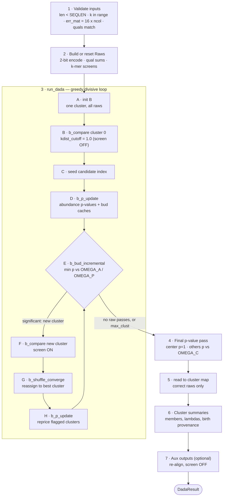

# The `dada` algorithm, step by step

A walkthrough of what `dada` actually does in this implementation, in the order
it does it. Two layers:

- **The wrapper** — [`dada_uniques_cached`][w] validates inputs, prepares the
  `Raw` objects, and post-processes the finished partition into a `DadaResult`.
- **The core loop** — [`run_dada`][core] is the greedy divisive partition: start
  with one cluster holding everything, then repeatedly split off the most
  significantly over-abundant unique.

Ported from Ben Callahan's DADA2 (`dada_uniques`, `run_dada`, `b_compare`,
`b_shuffle2`, `b_bud`); see [About](about.md) for provenance. All source links on
this page are pinned to commit
[`045f035`](https://github.com/HPCBio/dada2-rs/tree/045f035782a421185d4d1313f7708a667ebe62db),
so they stay valid as the code moves.

## Control flow

Step **E** is the only place clusters are created. Everything after the loop
assigns reads to the clusters that already exist.

## Layer 1 — the wrapper

Source: [`src/dada.rs:236`][w]

### 1. Validate inputs

[`dada.rs:241-287`][s1]

Non-empty input; `maxlen < SEQLEN`; `kmer_size` within
`KMER_SIZE_MIN..=KMER_SIZE_MAX`; every sequence strictly longer than *k*; error
matrix exactly `16 × err_ncol`. If *any* input carries quality scores, every
qual string must match its sequence length.

### 2. Build or reset the `Raw`s

[`dada.rs:290-400`][s2]

Either reuse a cached `Vec<Raw>` — only per-iteration mutable state is cleared
by `reset_for_iteration()`, so sequences, quals and k-mer vectors persist across
calls (this is the `learn-errors` self-consistency path) — or build fresh: 2-bit
encode each sequence, precompute quality sums, and assign the `kmer8` presence
screen plus `kord`.

!!! note "Verbose only"
    This step also prints the resident-footprint and k-mer fill/diversity
    diagnostics (issues 32 and 43). Instrumentation only — no effect on the
    partition.

### 3. Call `run_dada`

[`dada.rs:403`][s3] — Layer 2, below. Returns the finished partition `B`.

### 4. Final per-raw p-value pass

[`dada.rs:407-426`][s4]

Per cluster, per member: the center gets `p = 1.0, correct = true`; every other
member gets `p = calc_pA(reads, lambda × cluster_reads)` and
`correct = p >= omega_c`.

!!! important "This is where `OMEGA_C` acts"
    It decides whether a unique's reads are *attributed* to its cluster — not
    which clusters exist. Cluster creation is governed by `OMEGA_A` /
    `OMEGA_P`, back in step E.

### 5. Build the read → cluster map

[`dada.rs:429-436`][s5]

Only `correct` raws get a map entry; the rest stay `None`. These are the "failed
uniques" surfaced by `--failed-uniques` (see [Diagnostics](diagnostics.md)).

### 6. Cluster summaries

[`dada.rs:439-467`][s6]

Center sequence and read count, the member list with per-member hamming /
lambda / p-value, plus birth provenance: type, parent, p-value, fold, e,
hamming.

### 7. Aux outputs (optional)

[`dada.rs:471`][s7], [`compute_aux` at `dada.rs:507`][s7b]

R-parity `$clustering`, `$birth_subs`, `$subqual`, `$clusterquals`.

!!! warning "Re-aligns with the k-mer screen off"
    This pass sets `use_kmers = false, kdist_cutoff = 1.0` so that every
    raw-vs-center comparison yields a `Sub`. That is why the kdist cutoff cannot
    screen error copies out of the final substitution tally — see
    [KDIST cutoff decoupling](findings/kdist-cutoff-decoupling.md).

## Layer 2 — the greedy divisive loop

Source: [`src/dada.rs:606`][core]

### A. Initialize `B`

[`dada.rs:608`][sA] — one cluster holding every raw, center = the most abundant
unique.

### B. First `b_compare`, screen disabled

[`dada.rs:636-665`][sB], [`cluster.rs:38`][cmp]

Align each raw to the center, `compute_lambda` from the sub, the error matrix
and the quals, and store a `Comparison` only when
`lambda × total_reads > raw.e_minmax` — the "could this cluster ever attract
this raw" prune. Under `greedy`, raws more abundant than the center, and locked
raws, skip alignment entirely.

!!! note "`kdist_cutoff: 1.0` here is deliberate"
    Cluster 0 must accumulate a comparison for *every* raw, because
    `b_shuffle2` depends on it.

### C. Seed the candidate index

[`dada.rs:670-671`][sC]

`cand_index[raw] = [(cluster, lambda, hamming), …]`, appended once per cluster
in ascending cluster order. That ordering is what preserves the
lowest-cluster-index tie-break during shuffles.

### D. Pre-loop `b_p_update`

[`dada.rs:673-680`][sD]

Compute each non-center raw's abundance p-value; refresh each cluster's cached
`bud_min` / `bud_min_prior` candidate.

### E. `b_bud_incremental` — the only place clusters are born

[`dada.rs:692`][sE]

Combine the per-cluster cached minima in *O(nclusters)* to find the globally
smallest p-value raw, then test it against Bonferroni-corrected `omega_a` — or
`omega_p` for prior-bearing raws. If nothing passes, `break`. The loop also
stops at `max_clust` (0 means "up to nraw").

### F. `b_compare` on the new cluster

[`dada.rs:716-739`][sF]

Same routine as step B, but now with the real `params.align` — screen on. Then
`index_add_cluster` appends the new comparisons to the candidate index.

### G. `b_shuffle_converge`

[`dada.rs:750`][sG]

Move every non-center raw to the cluster maximizing its expected read count,
iterating to stability or `MAX_SHUFFLE`. Incremental: `compmax` is rebuilt once,
then only raws whose candidate clusters' read counts changed get re-scored —
byte-identical to looping `b_shuffle2`.

### H. `b_p_update`

[`dada.rs:764`][sH]

Reprice p-values for clusters flagged `update_e` and refresh the bud caches,
which is exactly what step E consumes on the next turn of the loop.

!!! note "Verbose phase accounting"
    The tail block at [`dada.rs:777-863`][sV] prints phase times, map parallel
    efficiency, shuffle redundancy, bud-combine volume and p-update churn — the
    instrumentation behind the issue-85 and issue-87 gating decisions. See
    [Results](results.md).

## Where each threshold acts

| Parameter | Step | What it decides |
| --- | --- | --- |
| `OMEGA_A` | E | Whether a unique is significant enough to become a new cluster |
| `OMEGA_P` | E | Same test, for prior-bearing (pseudo-pooled) uniques |
| `OMEGA_C` | 4 | Whether a member's reads are attributed to its cluster, or fail out |
| `kdist_cutoff` | F | k-mer screen on candidate alignments — forced off in B and 7 |
| `min_fold`, `min_hamming`, `min_abund` | D, E, H | Eligibility of a raw as a bud candidate; must match between the two |
| `max_clust` | E | Hard stop on loop iterations (0 = nraw) |
| `greedy` | B, F | Skips aligning raws more abundant than the center, and locked raws |

See [Parameters](parameters.md) for the CLI flags that set these.

[w]: https://github.com/HPCBio/dada2-rs/blob/045f035782a421185d4d1313f7708a667ebe62db/src/dada.rs#L236
[core]: https://github.com/HPCBio/dada2-rs/blob/045f035782a421185d4d1313f7708a667ebe62db/src/dada.rs#L606
[cmp]: https://github.com/HPCBio/dada2-rs/blob/045f035782a421185d4d1313f7708a667ebe62db/src/cluster.rs#L38
[s1]: https://github.com/HPCBio/dada2-rs/blob/045f035782a421185d4d1313f7708a667ebe62db/src/dada.rs#L241-L287
[s2]: https://github.com/HPCBio/dada2-rs/blob/045f035782a421185d4d1313f7708a667ebe62db/src/dada.rs#L290-L400
[s3]: https://github.com/HPCBio/dada2-rs/blob/045f035782a421185d4d1313f7708a667ebe62db/src/dada.rs#L403
[s4]: https://github.com/HPCBio/dada2-rs/blob/045f035782a421185d4d1313f7708a667ebe62db/src/dada.rs#L407-L426
[s5]: https://github.com/HPCBio/dada2-rs/blob/045f035782a421185d4d1313f7708a667ebe62db/src/dada.rs#L429-L436
[s6]: https://github.com/HPCBio/dada2-rs/blob/045f035782a421185d4d1313f7708a667ebe62db/src/dada.rs#L439-L467
[s7]: https://github.com/HPCBio/dada2-rs/blob/045f035782a421185d4d1313f7708a667ebe62db/src/dada.rs#L471
[s7b]: https://github.com/HPCBio/dada2-rs/blob/045f035782a421185d4d1313f7708a667ebe62db/src/dada.rs#L507
[sA]: https://github.com/HPCBio/dada2-rs/blob/045f035782a421185d4d1313f7708a667ebe62db/src/dada.rs#L608
[sB]: https://github.com/HPCBio/dada2-rs/blob/045f035782a421185d4d1313f7708a667ebe62db/src/dada.rs#L636-L665
[sC]: https://github.com/HPCBio/dada2-rs/blob/045f035782a421185d4d1313f7708a667ebe62db/src/dada.rs#L670-L671
[sD]: https://github.com/HPCBio/dada2-rs/blob/045f035782a421185d4d1313f7708a667ebe62db/src/dada.rs#L673-L680
[sE]: https://github.com/HPCBio/dada2-rs/blob/045f035782a421185d4d1313f7708a667ebe62db/src/dada.rs#L692
[sF]: https://github.com/HPCBio/dada2-rs/blob/045f035782a421185d4d1313f7708a667ebe62db/src/dada.rs#L716-L739
[sG]: https://github.com/HPCBio/dada2-rs/blob/045f035782a421185d4d1313f7708a667ebe62db/src/dada.rs#L750
[sH]: https://github.com/HPCBio/dada2-rs/blob/045f035782a421185d4d1313f7708a667ebe62db/src/dada.rs#L764
[sV]: https://github.com/HPCBio/dada2-rs/blob/045f035782a421185d4d1313f7708a667ebe62db/src/dada.rs#L777-L863
