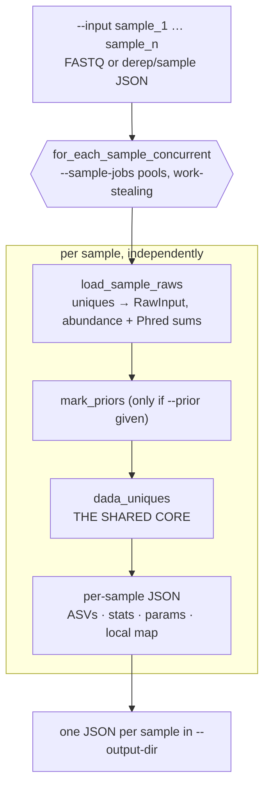

# `dada` — per-sample denoising

Each sample is denoised as an independent experiment: its own unique table, its
own call into [the shared core](algorithm-core.md), its own output JSON. No
information crosses between samples.

Source: [`main.rs:695`][cmd]

## What this mode does

The `dada_uniques` node is the entire content of
[The shared denoising core](algorithm-core.md) — click it, or follow that link.

## Step by step

### 1. Fan samples across sub-pools

[`for_each_sample_concurrent`, `main.rs:4356`][fan]

`--sample-jobs` sets how many samples are in flight at once. The `--threads`
budget is split into that many rayon sub-pools, remainder spread so pools differ
by at most one thread (20 threads / 3 jobs → 7, 7, 6). Samples are claimed from a
shared atomic counter, so a pool that finishes early picks up the next sample
rather than idling.

!!! note "Two levels of parallelism"
    Threads are divided *between* samples and then used *within* a sample by
    `b_compare_parallel` inside the core. `--sample-jobs 1` gives one sample all
    threads; a high value trades intra-sample parallelism for sample throughput.
    The first error encountered stops the remaining samples.

### 2. Load one sample's uniques

[`load_sample_raws`, `main.rs:4407`][load]

Accepts either FASTQ (dereplicated on the fly) or a `derep`/sample JSON. Produces
`RawInput`s carrying the sequence, its in-sample abundance, and per-position Phred
**sums**. Errors if the sample has no uniques. Any sample name embedded in the
JSON is picked up here; otherwise the filename stem is used.

### 3. Optionally mark priors

[`mark_priors`, `main.rs:4456`][priors]

Only when `--prior` is given. Sequences matching the FASTA are flagged, which
makes the core test them against `OMEGA_P` rather than the Bonferroni-corrected
`OMEGA_A`. Most `dada` runs skip this — it is
[`dada-pseudo`](algorithm-dada-pseudo.md) that uses priors as a matter of course.

### 4. Denoise and serialize

[`denoise_and_serialize`, `main.rs:4535`][ser]

Calls `dada::dada_uniques` on this sample's `RawInput`s inside the sample's
sub-pool, then writes one JSON per sample: the ASVs with abundances, align/shroud
stats, the resolved run parameters, and the local unique → local cluster map.
`--failed-uniques` rows are collected here from the map's `None` entries.

## What is *not* here

- **No merge step.** The unique table is one sample's, so `nraw` — the Bonferroni
  divisor for the abundance p-value in the core's step E — is a per-sample count.
- **No projection step.** Cluster indices in the output are already local to the
  sample, unlike [`dada-pooled`](algorithm-dada-pooled.md), which renumbers a
  global partition per sample.
- **No second pass.** Contrast [`dada-pseudo`](algorithm-dada-pseudo.md).

The practical consequence: a variant present at one read in each of forty samples
is a singleton forty times over and is never called. That is the sensitivity gap
the other two modes exist to close.

!!! important "Output is stable under sample set changes"
    Because nothing crosses samples, adding or removing samples cannot change an
    existing sample's ASVs. Neither pooled nor pseudo-pooled offers this.

[cmd]: https://github.com/HPCBio/dada2-rs/blob/33ed55b1d6078aa16c8ab4b6db0509383b0c4e09/src/main.rs#L695
[fan]: https://github.com/HPCBio/dada2-rs/blob/33ed55b1d6078aa16c8ab4b6db0509383b0c4e09/src/main.rs#L4356
[load]: https://github.com/HPCBio/dada2-rs/blob/33ed55b1d6078aa16c8ab4b6db0509383b0c4e09/src/main.rs#L4407
[priors]: https://github.com/HPCBio/dada2-rs/blob/33ed55b1d6078aa16c8ab4b6db0509383b0c4e09/src/main.rs#L4456
[ser]: https://github.com/HPCBio/dada2-rs/blob/33ed55b1d6078aa16c8ab4b6db0509383b0c4e09/src/main.rs#L4535
