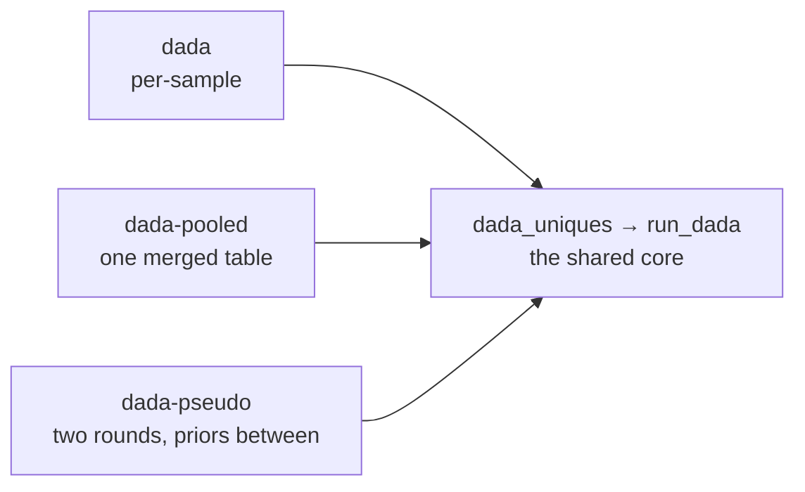

# Denoising modes: overview

`dada2-rs` denoises with three subcommands. They differ only in **what unique
table gets handed to the denoiser, and how many times** — the denoising itself
is one shared code path, documented once in
[The shared denoising core](algorithm-core.md).

That is the whole distinction. Each mode page below covers only its own wrapper:
how it assembles the unique table, how many times it invokes the core, and how it
projects the result back to per-sample output.

| | [`dada`](algorithm-dada.md) | [`dada-pooled`](algorithm-dada-pooled.md) | [`dada-pseudo`](algorithm-dada-pseudo.md) |
| --- | --- | --- | --- |
| Core invocations | one per sample | **one, total** | two per sample |
| Unique table | one sample's uniques | all samples merged | one sample's uniques |
| Cross-sample information | none from the run itself | full (single partition) | prior sequences only |
| Detects rare variants shared across samples | no | yes | yes, if they clear the prior rule |
| `OMEGA_P` in play | only with `--prior` | only with `--prior` | yes, in round 2 |
| Sensitive to sample count | no | yes | yes |
| Peak memory driver | one sample | merged table | one sample (streaming default) |

## Choosing between them

**`dada`** treats every sample as an independent experiment. A variant seen once
in each of forty samples is a singleton forty times over and is never called.
Cheapest, most parallel, and the only mode whose output for a sample does not
change when you add or remove other samples.

**`dada-pooled`** merges every sample's uniques into one table and partitions it
once, so abundance evidence sums across samples. Most sensitive, and the reason
that sensitivity exists is also its cost: memory scales with the merged table,
and the per-sample outputs are projections of one global partition rather than
independent results.

**`dada-pseudo`** approximates pooling in two passes: denoise each sample alone,
promote sequences that recur across samples to *priors*, then re-denoise each
sample with those priors flagged. Prior-bearing uniques are tested against
`OMEGA_P` instead of the Bonferroni-corrected `OMEGA_A`, which is what lets a
per-sample singleton be called when the pool has already vouched for it. Close to
pooled sensitivity at per-sample memory cost.

!!! note "`--prior` is available in all three modes"
    Flagging priors is a general mechanism, not a pseudo-pooled feature: `dada`
    and `dada-pooled` both accept a `--prior` FASTA, whose exact matches are
    tested against `OMEGA_P` instead of the Bonferroni-corrected `OMEGA_A`. What
    makes `dada-pseudo` distinct is that it *derives* its prior set from a first
    denoising round rather than taking one from you. If you already have a
    trusted sequence set, `dada --prior` gives you the same relaxation without
    the second pass.

!!! note "The modes are not nested"
    Pseudo-pooled is not "pooled, cheaper" — it is a different rule. Pooled sums
    abundance into one significance test; pseudo relaxes the threshold for
    sequences that passed elsewhere. They can disagree in both directions.

## Where the shared core sits

Every mode ends up calling `dada::dada_uniques`, which validates its inputs,
runs the greedy divisive loop `run_dada`, and post-processes the partition. The
thresholds (`OMEGA_A`, `OMEGA_C`, `OMEGA_P`, `kdist_cutoff`, the bud-eligibility
trio) all act inside it, at the steps tabulated in
[The shared denoising core](algorithm-core.md#where-each-threshold-acts).
